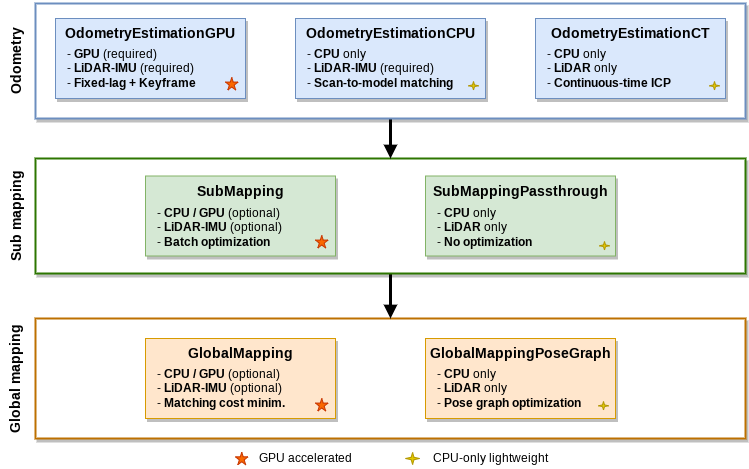

# GLIL CPU Reproduction Fork

Reproduction-first GLIL fork for LiDAR odometry experiments: validated
MegaParticles configs, official Ouster smoke guardrails, and CI-checked
CPU/CUDA Docker builds.

[](https://github.com/rsasaki0109/glil_unofficial/stargazers)
[](https://github.com/rsasaki0109/glil_unofficial/releases)
[](https://github.com/rsasaki0109/glil_unofficial/actions/workflows/build.yml)
[](https://github.com/rsasaki0109/glil_unofficial/actions/workflows/gendoc.yml)
[](LICENSE)


## 30-Second Summary

| Signal | Status |
|---|---|
| MegaParticles APE checks | 3/3 Track B+C PASS |
| Strongest deterministic recipe | `outdoor_hard_01a`, RMSE `0.906313`, 5/5 byte-identical |
| Official Ouster smoke path | `1122` pose rows, fallback `0`, bitset abort `0` |
| Docker confidence | CPU matrix and CUDA images pass on `dev` |

## 3 Commands To Try

After `source colcon_ws/install/setup.bash`, these three scripted tools run from
the repo root without any other setup and produce small, shareable tables:

```bash
# 1. Compare full VGICP / uniform / exact-Caratheodory on the bundled fixture.
glil_coreset_benchmark_summary \
  --csv sample=glil_unofficial/config/sample_coreset_benchmark.csv \
  --format markdown

# 2. Compare a baseline and perception-enabled run directory side by side.
glil_perception_run_compare \
  --run baseline=glil_unofficial/config/sample_perception_run_compare/baseline \
  --run perception=glil_unofficial/config/sample_perception_run_compare/perception \
  --format markdown

# 3. Package a reproduction run directory into a shareable Markdown bundle.
glil_reproduction_bundle \
  --run-dir glil_unofficial/config/sample_reproduction_bundle \
  --ape glil_unofficial/config/sample_reproduction_bundle/evo_ape.txt \
  --benchmark-csv glil_unofficial/config/sample_reproduction_bundle/coreset_benchmark.csv \
  --perception-report sample=glil_unofficial/config/sample_perception_factor_report.csv \
  --git-commit sample-sha \
  --format markdown
```

All three exit `0` on every CI run; see [Sample Outputs](#sample-outputs) for
what they print.

## Start Here

| If you want to... | Use this |
|---|---|
| Check the headline evidence | [Reproduction scoreboard](docs/reproduction.md) |
| Bundle a reproduction run | `glil_reproduction_bundle --run-dir run --perception-report run/perception_report.csv --format markdown` |
| Pick the validated config | [Recommended Configs](#recommended-configs) |
| Build the CI-tested Docker image | [Run A Docker Build](#run-a-docker-build) |
| Read the generated docs | <https://rsasaki0109.github.io/glil_unofficial/> |
| Inspect exact sampling support | [ICRA2025 Exact Sampling Notes](docs/exact_sampling.md) |
| Run the coreset benchmark | `glil_coreset_benchmark --target-cloud target --source-cloud source --csv` |
| Summarize coreset benchmark CSVs | `glil_coreset_benchmark_summary --csv run=coreset_benchmark.csv --format markdown` |
| Run perception CSV/config/report workflow | `glil_perception_workflow --batch-csv frames.csv --run-dir perception_run --cloud-format kitti-bin` |
| Summarize perception reports | `glil_perception_report_summary --report run=perception_report.csv --format markdown` |
| Compare a baseline and perception run | `glil_perception_run_compare --run baseline=run_base --run perception=run_perc --format markdown` |
| Generate perception CSV from point clouds | `glil_cloud_landmark_extractor --batch-csv frames.csv --output landmarks.csv` |
| Generate perception CSV and GLIL config | `glil_cloud_landmark_extractor --batch-csv frames.csv --output landmarks.csv --config-root run_config` |
| Report perception CSV factor readiness | `glil_perception_factor_report --csv cloud_landmarks.csv --config-root run_config` |
| Wire an existing perception CSV into GLIL config | `glil_perception_config_generator --config-root run_config --csv cloud_landmarks.csv` |
| Try perception landmark factors | [Perception Factors](docs/perception_factors.md) |
| Report your own run | [Reproduction report issue](https://github.com/rsasaki0109/glil_unofficial/issues/new?template=reproduction_report.md) |

## Run A Docker Build

CPU image, matching the CI base-image pattern:

```bash
docker build \
  -f docker/ubuntu/Dockerfile.gcc \
  --build-arg BASE_IMAGE=koide3/gtsam_points:jammy_gtsam4.3a0 \
  -t glil-unofficial:jammy-gcc \
  .
```

CUDA image:

```bash
docker build \
  -f docker/ubuntu/Dockerfile.gcc.cuda \
  --build-arg BASE_IMAGE=koide3/gtsam_points:jammy_cuda12.2_gtsam4.3a0 \
  -t glil-unofficial:jammy-cuda-gcc \
  .
```

## Sample Outputs

### Coreset benchmark summary

```text
| run    | mode               | selected rows | row ratio | reuse us | reuse speedup vs baseline | rel_aug_error |
|--------|--------------------|--------------:|----------:|---------:|--------------------------:|--------------:|
| sample | full_vgicp         |         2,048 |    1.0000 | 14,150.0 |                      1.00 |     0.000e+00 |
| sample | uniform_sample     |            64 |    0.0312 |  2,080.0 |                      6.80 |     1.280e-01 |
| sample | exact_caratheodory |            64 |    0.0312 |    210.0 |                     67.38 |     4.800e-12 |
```

Full CSV fixture at `glil_unofficial/config/sample_coreset_benchmark.csv`.
Details in [ICRA2025 Exact Sampling Notes](docs/exact_sampling.md#benchmark-summary-tool).

### Perception on/off comparison (real `indoor_easy_01` run)

```text
| run        | perception | status | RMSE (m) | ΔRMSE vs baseline | accepted obs | accepted match rate |
|------------|------------|--------|---------:|------------------:|-------------:|--------------------:|
| baseline   | off        | PASS   | 1.019250 |          0.000000 |           NA |                  NA |
| perception | on         | PASS   | 1.019281 |          0.000031 |            8 |        100.000000% |
```

ΔRMSE of `+31 µm` is below the mapping noise floor and the table is not an
accuracy claim; see
[Real-run example](docs/perception_factors.md#real-run-example-indoor_easy_01)
for the honest writeup including the readiness vs runtime injection gap.

### Reproduction bundle excerpt

```text
| field | value |
|-------|-------|
| status | PASS |
| git commit | `a97ec89bd24a98bfd1a1fe494a7b21d1a89398b9` |
| run directory | `results/latest_glim/outdoor_hard_01a_reproduce_20260421` |

| label  | extracted metrics                                                                               |
|--------|-------------------------------------------------------------------------------------------------|
| evo_ape | max=2.692416, mean=0.796697, median=0.751121, rmse=0.906313, sse=2347.571431, std=0.432062    |
```

Full example in [Reproduction Bundle example](docs/reproduction.md#example-outdoor_hard_01a-reproduction).

## Verification Status

Each capability is marked so readers know what to trust right now and what is
still exploratory:

| Area | Status | Notes |
|---|---|---|
| MegaParticles APE reproduction (3 datasets) | CI-verified + locally verified | scoreboard in `docs/reproduction.md`, per-dataset `reproduction_bundle.md` under `results/latest_glim/*_reproduce_20260421/` |
| Official Ouster sample smoke check | CI-verified | `1122` pose rows, fallback/bitset counters in scoreboard |
| CPU + CUDA Docker builds | CI-verified | matrix in `.github/workflows/build.yml` |
| `VGICP_CORESET` exact-sampling factor | CI-verified (factor smoke + benchmark summary fixture) | real-cloud benchmark numbers are locally verified per user |
| Coreset benchmark summary tool | CI-verified (fixture smoke) | synthetic fixture; real benchmarks still per user |
| ICRA 2025 paper flatwall dataset | Partial spot-check (8/8 sequences, not a reproduction) | `0.711 m` avg ATE vs paper Proposed `0.190 m`; odometry-layer exact sampling and coreset tuning are explicit non-goals. See [flatwall spot-check](docs/exact_sampling.md#partial-flatwall-spot-check-all-8-sequences) |
| Perception CSV injector end-to-end | Locally verified on `indoor_easy_01` | see `docs/perception_factors.md#real-run-example-indoor_easy_01`; runtime injection count depends on submap stamp alignment |
| Perception run comparison tool | CI-verified (fixture smoke) + locally verified (real `indoor_easy_01` run) | comparison is honest about readiness vs runtime gap |
| ROS/ROS 2 perception detector adapters | Not implemented | offline CSV is the only supported perception input today |

## Why Star This Fork

- It packages the 2026-04 MegaParticles reproduction evidence in a form that is
  easy to inspect and rerun.
- It keeps a small scoreboard and bundle generator for validated configs instead
  of asking users to infer results from raw logs.
- It includes CPU and CUDA Docker build checks so dependency drift is visible.
- It exposes `VGICP_CORESET` exact-sampling diagnostics for CPU registration
  factor experiments. The fork tracks the Fast-Caratheodory row selection and
  augmented-Hessian preservation ideas from Koide et al., ICRA 2025; it does
  not attempt to re-run the paper's headline accuracy on the paper's own
  datasets, and `docs/exact_sampling.md#reproduction-scope` spells out exactly
  what is a paper-reproduction target versus a bridge/demo piece.
- It includes synthetic and real-cloud coreset benchmarks for comparing full
  VGICP, uniform sampling, and Fast-Caratheodory row selection, plus a
  summary tool that turns the benchmark CSV into a baseline-relative table.
- It ships an opt-in perception landmark factor path, point-cloud-to-CSV
  extractor, one-command CSV/config/report workflow, report summarizer, and a
  baseline vs perception run comparator for stable geometric cues.
- It gives LiDAR-SLAM users a concrete place to file reproduction reports.

If these reproduction configs save you time, starring the repo helps other
robotics and LiDAR-SLAM users find it.

## Introduction

**GLIL** is a versatile and extensible range-based 3D mapping framework.

- ***Accuracy:*** GLIL is based on direct multi-scan registration error minimization on factor graphs that enables to accurately retain the consistency of mapping results. GPU acceleration is supported to maximize the mapping speed and quality.
- ***Easy-to-use:*** GLIL offers an interactive map correction interface that enables the user to manually correct mapping failures and easily refine mapping results.
- ***Versatility:*** As we eliminated sensor-specific processes, GLIL can be applied to any kind of range sensors including:
    - Spinning-type LiDAR (e.g., Velodyne HDL32e)
    - Non-repetitive scan LiDAR (e.g., Livox Avia)
    - Solid-state LiDAR (e.g., Intel Realsense L515)
    - RGB-D camera (e.g., Microsoft Azure Kinect)
- ***Extensibility:*** GLIL provides the global callback slot mechanism that allows to access the internal states of the mapping process and insert additional constraints to the factor graph. We also release [glim_ext](https://github.com/koide3/glim_ext) that offers example implementations of several extension functions (e.g., explicit loop detection, LiDAR-Visual-Inertial odometry estimation).

**Fork docs:** [https://rsasaki0109.github.io/glil_unofficial/](https://rsasaki0109.github.io/glil_unofficial/)

**Upstream GLIM docs:** [https://koide3.github.io/glim/](https://koide3.github.io/glim/)

**Docker hub:** [koide3/glim_ros1](https://hub.docker.com/repository/docker/koide3/glim_ros1/tags), [koide3/glim_ros2](https://hub.docker.com/repository/docker/koide3/glim_ros2/tags)
**Related packages:** [gtsam_points](https://github.com/koide3/gtsam_points), [glim](https://github.com/koide3/glim), [glim_ros1](https://github.com/koide3/glim_ros1), [glim_ros2](https://github.com/koide3/glim_ros2), [glim_ext](https://github.com/koide3/glim_ext)

Tested on Ubuntu 22.04 /24.04 with CUDA 12.2, and NVIDIA Jetson Orin.

## Fork Reproduction Status (2026-04-22)

This fork carries the 2026-04 GLIL CPU reproduction configs. The local
reproduction workspace verifies the available evidence bundle with a
manifest-driven runner and records the headline results below.

The fork depends on `rsasaki0109/gtsam_points#1` for the opt-in fixed-lag
smoother fallback cadence and the `FastOccupancyGrid` non-finite/out-of-range
coordinate guard.

### Verified Local Results

| dataset | kind | status | RMSE | upstream GLIM | playback mean | Track B | Track C | traj sha256 |
|---|---|---|---:|---:|---:|---|---|---|
| `indoor_easy_01` | APE | PASS | `1.019250` | `3.383012` | `1.000x` | PASS | PASS | `93ff42b99c304dd7...` |
| `outdoor_hard_01a` | APE | PASS | `0.906313` | `4.321651` | `1.000x` | PASS | PASS | `9968e55d9836f428...` |
| `outdoor_kidnap_a` | APE | PASS | `20.349845` | `21.701012` | `1.000x` | PASS | PASS | `de973cbf972bc4ca...` |
| `os1_128_01_downsampled` | smoke | WARN | NA | NA | `0.201x` | NA | NA | `c384c08fc8b187eb...` |

Track B is upstream GLIM RMSE + 20%. Track C is playback mean `>= 0.95x`.
Both tracks apply only to entries with ground-truth APE. The overall manifest
status is `WARN` because the Ouster smoke run is below the playback warning
threshold, not because of a stability or accuracy failure.

### Recommended Configs

| dataset | config | note |
|---|---|---|
| `indoor_easy_01` | `config_fair_glil_true_sample_t128_indoor_d4k_k1_rw_csp15_ct64_lag4` | RMSE `1.019250`, Track B/C PASS |
| `outdoor_hard_01a` | `config_fair_glil_true_sample_t128_hard_csp15_ct64_lag4_ffb100_skip16` | RMSE `0.906313`, 5/5 byte-identical hard recipe, Track B/C PASS |
| `outdoor_kidnap_a` | `config_fair_glil_true_sample_t128_k1` | RMSE `20.349845`, Track B/C PASS |
| `os1_128_01_downsampled` | `config_official_os1_128_01_downsampled_acc1` | official Ouster smoke; `1123` frames, `1122` pose rows, fallback `0`, bitset abort `0` |

The Ouster bag publishes IMU accelerations in m/s^2, so `glil_ros.acc_scale`
must be `1.0`; using `9.80665` is invalid for this sample and can drive
occupancy coordinates out of range. This sample has no bundled local GT APE
reference, so it is a completion/stability regression check rather than a paper
accuracy-table reproduction.

If you find this package useful for your project, please consider leaving a comment [here](https://github.com/koide3/glim/issues/19). It would help the author receive recognition in his organization and keep working on this project.

[](https://github.com/rsasaki0109/glil_unofficial/actions/workflows/build.yml)
[](https://github.com/koide3/glim_ros1/actions/workflows/build.yml)
[](https://github.com/koide3/glim_ros2/actions/workflows/build.yml)
[](https://github.com/koide3/glim_ext/actions/workflows/build.yml)

## Dependencies
### Mandatory
- [Eigen](https://eigen.tuxfamily.org/index.php)
- [nanoflann](https://github.com/jlblancoc/nanoflann)
- [OpenCV](https://opencv.org/)
- [GTSAM](https://github.com/borglab/gtsam)
- [gtsam_points](https://github.com/koide3/gtsam_points)

### Optional
- [CUDA](https://developer.nvidia.com/cuda-toolkit)
- [OpenMP](https://www.openmp.org/)
- [ROS/ROS2](https://www.ros.org/)
- [Iridescence](https://github.com/koide3/iridescence)

## Video

See more at [Video Gallery](https://github.com/koide3/glim/wiki/Video-Gallery).

[](https://www.youtube.com/watch?v=_fwK4awbW18)
[](https://www.youtube.com/watch?v=CIfRqeV0irE)

Left: Mapping with various range sensors, Right: Outdoor driving test with Livox MID360

## Estimation modules

GLIL provides several estimation modules to cover use scenarios, from robust and accurate mapping with a GPU to lightweight real-time mapping with a low-specification PC like Raspberry Pi.



## License

If you find this package useful for your project, please consider leaving a comment [here](https://github.com/koide3/glim/issues/19). It would help the author receive recognition in his organization and keep working on this project. Please also cite the following paper if you use this package in your academic work.

This package is released under the MIT license. For commercial support, please contact ```k.koide@aist.go.jp```.

## Related work

Koide et al., "GLIM: 3D Range-Inertial Localization and Mapping with GPU-Accelerated Scan Matching Factors", Robotics and Autonomous Systems, 2024, [[DOI]](https://doi.org/10.1016/j.robot.2024.104750) [[Arxiv]](https://arxiv.org/abs/2407.10344)

The GLIM framework involves ideas expanded from the following papers:  
- (LiDAR-IMU odometry and mapping) "Globally Consistent and Tightly Coupled 3D LiDAR Inertial Mapping", ICRA2022 [[DOI]](https://doi.org/10.1109/ICRA46639.2022.9812385)
- (Global registration error minimization) "Globally Consistent 3D LiDAR Mapping with GPU-accelerated GICP Matching Cost Factors", IEEE RA-L, 2021, [[DOI]](https://doi.org/10.1109/LRA.2021.3113043)
- (GPU-accelerated scan matching) "Voxelized GICP for Fast and Accurate 3D Point Cloud Registration", ICRA2021, [[DOI]](https://doi.org/10.1109/ICRA48506.2021.9560835)

## Contact
[Kenji Koide](https://staff.aist.go.jp/k.koide/), k.koide@aist.go.jp<br>
National Institute of Advanced Industrial Science and Technology (AIST), Japan

