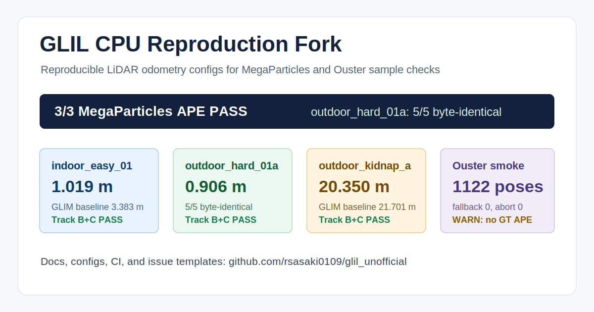

# GLIL CPU Reproduction Fork

Reproducible CPU-focused GLIL configs for LiDAR odometry experiments. This fork
packages the 2026-04 MegaParticles reproduction work, the deterministic
`outdoor_hard_01a` recipe, and an official Ouster sample smoke check.

[](https://github.com/rsasaki0109/glil_unofficial/stargazers)
[](LICENSE)
[](https://docs.ros.org/)



## Start Here

| If you want to... | Use this |
|---|---|
| Check the headline evidence | [Reproduction scoreboard](docs/reproduction.md) |
| Pick the validated config | [Recommended Configs](#recommended-configs) |
| Read the generated docs | <https://rsasaki0109.github.io/glil_unofficial/> |
| Report your own run | [Reproduction report issue](https://github.com/rsasaki0109/glil_unofficial/issues/new?template=reproduction_report.md) |

## Shareable Pitch

> GLIL CPU Reproduction Fork packages reproducible LiDAR odometry configs for
> MegaParticles samples and the official Ouster smoke path: 3/3 Track B+C PASS,
> `outdoor_hard_01a` at RMSE `0.906313`, and a 5/5 byte-identical hard recipe.

Why this fork is useful:

- Manifest-verified MegaParticles sample results: 3/3 Track B+C PASS.
- Deterministic hard config: `outdoor_hard_01a` 5/5 byte-identical at
  RMSE `0.906313`.
- Ouster sample guardrails: corrected `acc_scale=1.0`, clean smoke
  completion, no fallback/bitset abort.
- Drop-in config directories for reproducing the validated local runs.

If these reproduction configs save you time, starring the repo helps other
robotics and LiDAR-SLAM users find it.

## Introduction

**GLIL** is a versatile and extensible range-based 3D mapping framework.

- ***Accuracy:*** GLIL is based on direct multi-scan registration error minimization on factor graphs that enables to accurately retain the consistency of mapping results. GPU acceleration is supported to maximize the mapping speed and quality.
- ***Easy-to-use:*** GLIL offers an interactive map correction interface that enables the user to manually correct mapping failures and easily refine mapping results.
- ***Versatility:*** As we eliminated sensor-specific processes, GLIL can be applied to any kind of range sensors including:
    - Spinning-type LiDAR (e.g., Velodyne HDL32e)
    - Non-repetitive scan LiDAR (e.g., Livox Avia)
    - Solid-state LiDAR (e.g., Intel Realsense L515)
    - RGB-D camera (e.g., Microsoft Azure Kinect)
- ***Extensibility:*** GLIL provides the global callback slot mechanism that allows to access the internal states of the mapping process and insert additional constraints to the factor graph. We also release [glim_ext](https://github.com/koide3/glim_ext) that offers example implementations of several extension functions (e.g., explicit loop detection, LiDAR-Visual-Inertial odometry estimation).

**Fork docs:** [https://rsasaki0109.github.io/glil_unofficial/](https://rsasaki0109.github.io/glil_unofficial/)

**Upstream GLIM docs:** [https://koide3.github.io/glim/](https://koide3.github.io/glim/)

**Docker hub:** [koide3/glim_ros1](https://hub.docker.com/repository/docker/koide3/glim_ros1/tags), [koide3/glim_ros2](https://hub.docker.com/repository/docker/koide3/glim_ros2/tags)
**Related packages:** [gtsam_points](https://github.com/koide3/gtsam_points), [glim](https://github.com/koide3/glim), [glim_ros1](https://github.com/koide3/glim_ros1), [glim_ros2](https://github.com/koide3/glim_ros2), [glim_ext](https://github.com/koide3/glim_ext)

Tested on Ubuntu 22.04 /24.04 with CUDA 12.2, and NVIDIA Jetson Orin.

## Fork Reproduction Status (2026-04-22)

This fork carries the 2026-04 GLIL CPU reproduction configs. The local
reproduction workspace verifies the available evidence bundle with a
manifest-driven runner and records the headline results below.

The fork depends on `rsasaki0109/gtsam_points#1` for the opt-in fixed-lag
smoother fallback cadence and the `FastOccupancyGrid` non-finite/out-of-range
coordinate guard.

### Verified Local Results

| dataset | kind | status | RMSE | upstream GLIM | playback mean | Track B | Track C | traj sha256 |
|---|---|---|---:|---:|---:|---|---|---|
| `indoor_easy_01` | APE | PASS | `1.019250` | `3.383012` | `1.000x` | PASS | PASS | `93ff42b99c304dd7...` |
| `outdoor_hard_01a` | APE | PASS | `0.906313` | `4.321651` | `1.000x` | PASS | PASS | `9968e55d9836f428...` |
| `outdoor_kidnap_a` | APE | PASS | `20.349845` | `21.701012` | `1.000x` | PASS | PASS | `de973cbf972bc4ca...` |
| `os1_128_01_downsampled` | smoke | WARN | NA | NA | `0.201x` | NA | NA | `c384c08fc8b187eb...` |

Track B is upstream GLIM RMSE + 20%. Track C is playback mean `>= 0.95x`.
Both tracks apply only to entries with ground-truth APE. The overall manifest
status is `WARN` because the Ouster smoke run is below the playback warning
threshold, not because of a stability or accuracy failure.

### Recommended Configs

| dataset | config | note |
|---|---|---|
| `indoor_easy_01` | `config_fair_glil_true_sample_t128_indoor_d4k_k1_rw_csp15_ct64_lag4` | RMSE `1.019250`, Track B/C PASS |
| `outdoor_hard_01a` | `config_fair_glil_true_sample_t128_hard_csp15_ct64_lag4_ffb100_skip16` | RMSE `0.906313`, 5/5 byte-identical hard recipe, Track B/C PASS |
| `outdoor_kidnap_a` | `config_fair_glil_true_sample_t128_k1` | RMSE `20.349845`, Track B/C PASS |
| `os1_128_01_downsampled` | `config_official_os1_128_01_downsampled_acc1` | official Ouster smoke; `1123` frames, `1122` pose rows, fallback `0`, bitset abort `0` |

The Ouster bag publishes IMU accelerations in m/s^2, so `glil_ros.acc_scale`
must be `1.0`; using `9.80665` is invalid for this sample and can drive
occupancy coordinates out of range. This sample has no bundled local GT APE
reference, so it is a completion/stability regression check rather than a paper
accuracy-table reproduction.

If you find this package useful for your project, please consider leaving a comment [here](https://github.com/koide3/glim/issues/19). It would help the author receive recognition in his organization and keep working on this project.

[](https://github.com/rsasaki0109/glil_unofficial/actions/workflows/build.yml)
[](https://github.com/koide3/glim_ros1/actions/workflows/build.yml)
[](https://github.com/koide3/glim_ros2/actions/workflows/build.yml)
[](https://github.com/koide3/glim_ext/actions/workflows/build.yml)

## Dependencies
### Mandatory
- [Eigen](https://eigen.tuxfamily.org/index.php)
- [nanoflann](https://github.com/jlblancoc/nanoflann)
- [OpenCV](https://opencv.org/)
- [GTSAM](https://github.com/borglab/gtsam)
- [gtsam_points](https://github.com/koide3/gtsam_points)

### Optional
- [CUDA](https://developer.nvidia.com/cuda-toolkit)
- [OpenMP](https://www.openmp.org/)
- [ROS/ROS2](https://www.ros.org/)
- [Iridescence](https://github.com/koide3/iridescence)

## Video

See more at [Video Gallery](https://github.com/koide3/glim/wiki/Video-Gallery).

[](https://www.youtube.com/watch?v=_fwK4awbW18)
[](https://www.youtube.com/watch?v=CIfRqeV0irE)

Left: Mapping with various range sensors, Right: Outdoor driving test with Livox MID360

## Estimation modules

GLIL provides several estimation modules to cover use scenarios, from robust and accurate mapping with a GPU to lightweight real-time mapping with a low-specification PC like Raspberry Pi.


## License

If you find this package useful for your project, please consider leaving a comment [here](https://github.com/koide3/glim/issues/19). It would help the author receive recognition in his organization and keep working on this project. Please also cite the following paper if you use this package in your academic work.

This package is released under the MIT license. For commercial support, please contact ```k.koide@aist.go.jp```.

## Related work

Koide et al., "GLIM: 3D Range-Inertial Localization and Mapping with GPU-Accelerated Scan Matching Factors", Robotics and Autonomous Systems, 2024, [[DOI]](https://doi.org/10.1016/j.robot.2024.104750) [[Arxiv]](https://arxiv.org/abs/2407.10344)

The GLIM framework involves ideas expanded from the following papers:  
- (LiDAR-IMU odometry and mapping) "Globally Consistent and Tightly Coupled 3D LiDAR Inertial Mapping", ICRA2022 [[DOI]](https://doi.org/10.1109/ICRA46639.2022.9812385)
- (Global registration error minimization) "Globally Consistent 3D LiDAR Mapping with GPU-accelerated GICP Matching Cost Factors", IEEE RA-L, 2021, [[DOI]](https://doi.org/10.1109/LRA.2021.3113043)
- (GPU-accelerated scan matching) "Voxelized GICP for Fast and Accurate 3D Point Cloud Registration", ICRA2021, [[DOI]](https://doi.org/10.1109/ICRA48506.2021.9560835)

## Contact
[Kenji Koide](https://staff.aist.go.jp/k.koide/), k.koide@aist.go.jp<br>
National Institute of Advanced Industrial Science and Technology (AIST), Japan

